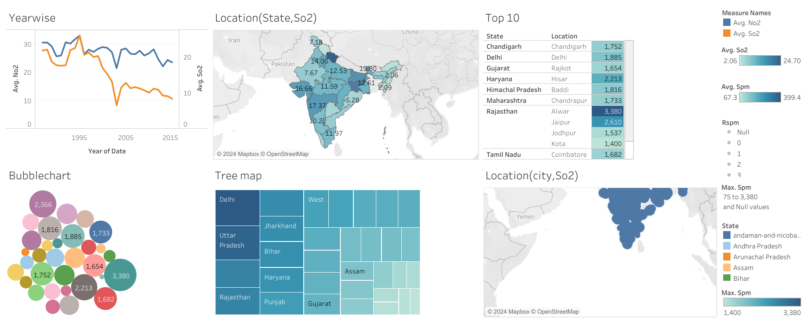
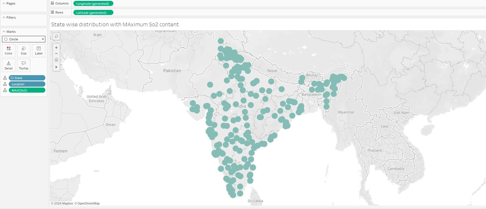
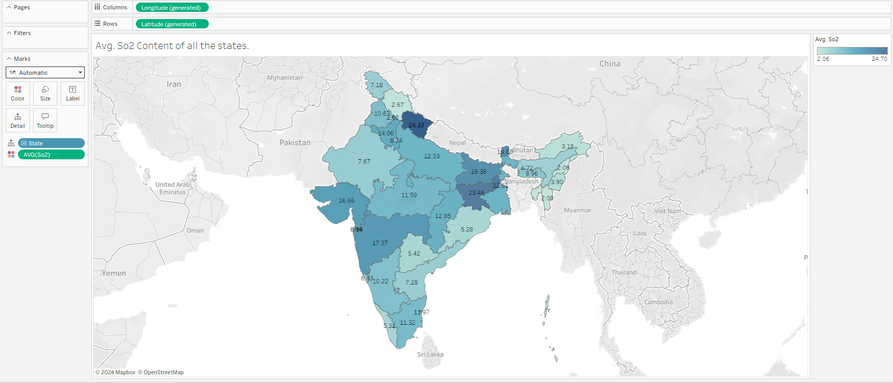
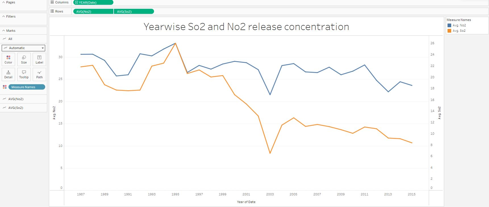
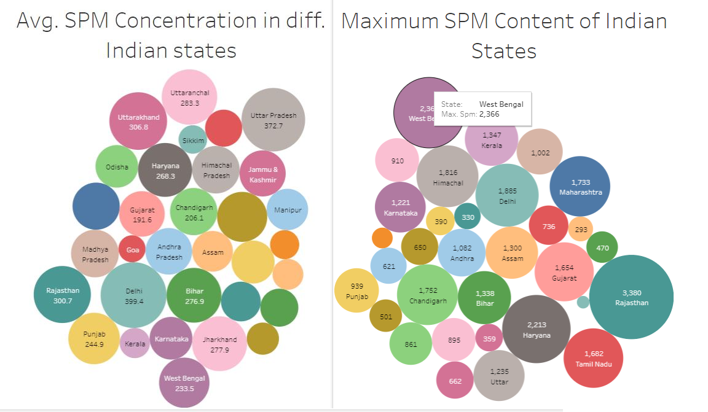
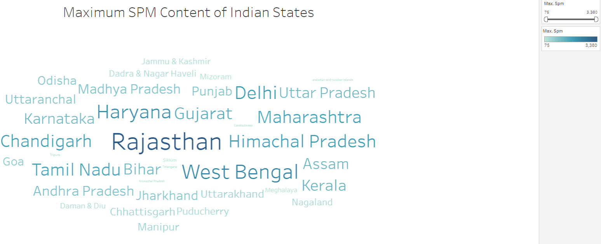

# Indian-Air-Quality-Data-analysis

## Project Description

This data is combined(across the years and states) version of the Historical Daily Ambient Air Quality Data released by the Ministry of Environment and Forests and Central Pollution Control Board of India under the National Data Sharing and Accessibility Policy (NDSAP).
      ROWS : 435743 COLUMNS :13

We performed diffrent regression and classification techniques to predict the data and validate the data across years and created a dashboard with the help of Tableau to visualize the techniques across maps.

## Installation  

There are 2 ways to run this project:
  
> Install python and setup the environment.

> Or upload this notebook to 
> 1. Google Colab (https://colab.google/) 
> 2. Jupyter Notebook (https://jupyter.org/try-jupyter/lab/?path=notebooks%2FIntro.ipynb)

  

## Run the Notebook

  

### If you are using Jupyter Notebook or Google Colab:

  

> Once you upload the notebook, ensure you add in the csv file to the same.

> Please note, you will have to edit the file path of csv with your local file path.

> Once both the files are uploaded and the path is edited, you are free to run the notebook online and view the insights gathered by me :star_struck:.

  

### If you are using Python environment

  

> Make sure python is rightly installed in the system using the following command -> python -v

  

> Create a directory and keep both the files in that directory.

  

> Once done, run all the cells of the notebook and check the insights.

## Insights

### Dashboard

> In this dashboard, I have included all the insights which I have drawn from this data mainly focusing on -

* So2 concentration depleted from every state.

* Yearwise variance in So2 concentration.

* Top 10 states of India with highest AQI and many more..

### Maximum So2 Concentration of Indian States

> This figure helps us to analyze the maximum So2 concentration of different states of India.

### Average So2 Content

> This figure helps us to understand average So2 concentration from different states. More dark is the colour, more is the So2 concentration.

### So2 and No2 Concentration Variance

> This image illustrates the comparison of So2 and No2 release content in last 20years.

### SPM Concentration Analysis

> These 2 images helps to understand the Maximum and Avg SPM concentration.

 
  

## Future Scope

> There are many more insights that can be derived in this domain which ultimately can be of a great help. You are welcome to create or fork the repo and contribute all the insights which you derive :smiley:

## Give it a Star

  

If you find this repo useful , give it a star :star: so as many people can get to know it.

## Credits

An initiative With :heart: from [Soham Wattamwar ](https://www.linkedin.com/in/soham-wattamwar-9b790119a)