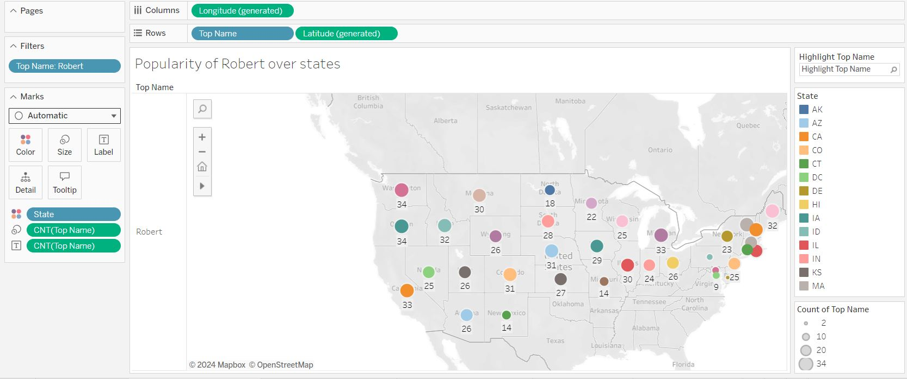
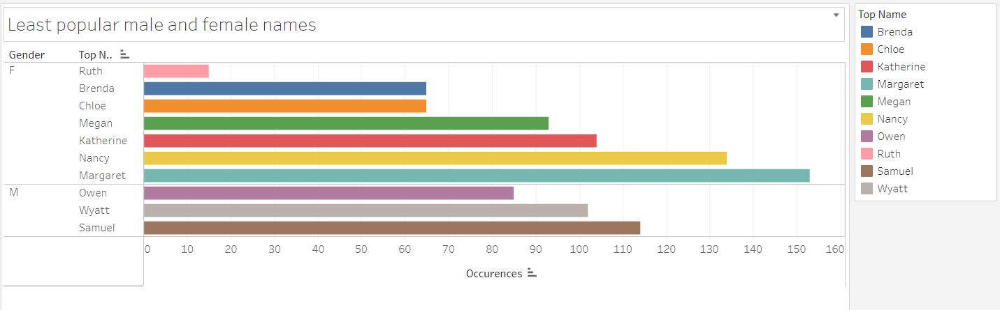
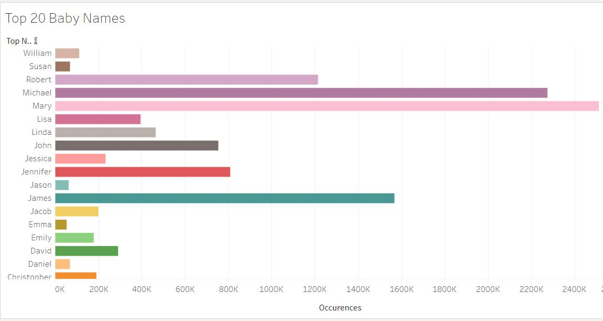

# Baby-Names-Data-Analysis

This project involves analysis of names kept of babies in the United States since a decade. There are some meaningful insights observed and performed in tableau. Feel free to check the trend of names of both a boy and a girl in different states of USA from 1910 till date :smiley:.

## Dataset Description

A total of 10,500 records were analysed with 5 different column sets as **State**, **Gender**, **Year**, **Top Name** and **Occurences**.

> * State - This includes list of all the states of United States whose data is used to perform evaluation.

> * Gender - As the name suggests, is the gender of the occureces to perform statistical analysis and gender based occurences.

> * Year - This includes year values from 1910 to 2012.

> * Top Name - This includes the top name of the particular state for that particular year.

> * Occurences - This value mentioned is the count of top name of that state in that year.

## Data Visualizations

> Fig1. illustrates the popularity of **Robert** name across the states of USA for all the years.

> Fig2. provides us details about the least popular male and female names for this year decade across all the states of USA.

> Fig3. enhances the Top20 names of male and female both with maximum occurences within this year range.

## Give it a Star

  

If you find this repo useful , give it a star :star: so as many people can get to know it.

## Credits

An initiative With :heart: from [Soham Wattamwar ](https://www.linkedin.com/in/soham-wattamwar-9b790119a)