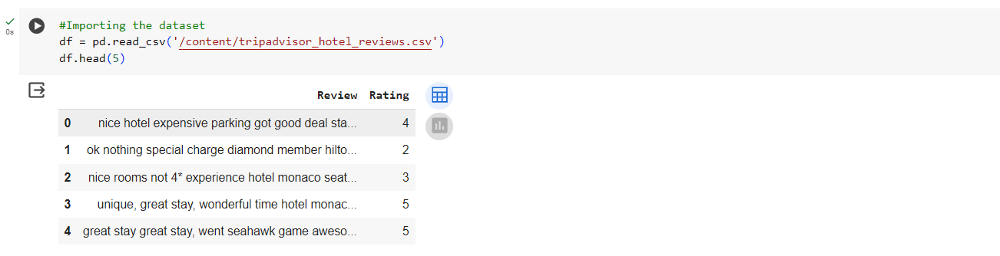

[Python Project](https://www.python.org/downloads/)  

# Hotel-Reviews-Analysis Project

A Data Analytics project where sentiment analysis is performed on the reviews listed on [Trip advisor](https://www.tripadvisor.in/) website.

## Installation  

There are 2 ways to run this project:
  
> Install python and setup the environment.

> Or upload this notebook to 
> 1. Google Colab (https://colab.google/) 
> 2. Jupyter Notebook (https://jupyter.org/try-jupyter/lab/?path=notebooks%2FIntro.ipynb)

  

## Run the Notebook

  

### If you are using Jupyter Notebook or Google Colab:

  

> Once you upload the notebook, ensure you add in the csv file to the same.

> Please note, you will have to edit the file path of csv with your local file path.

> Once both the files are uploaded and the path is edited, you are free to run the notebook online and view the insights gathered by me :star_struck:.

  

### If you are using Python environment

  

> Make sure python is rightly installed in the system using the following command -> python -v

  

> Create a directory and keep both the files in that directory.

  

> Once done, run all the cells of the notebook and check the insights.

## Insights

### Dataset Description

> This reviews data from Trip Advisor website has 21,000 rows with 2 different columns named as **Review** and **Rating**.

### Ratings Chart

> This image here shows the overview of ratings in the dataset where we observe more than **40%** with a ***5-Star*** rating .

### Sentiments of a Review

> With this image, you can find that after training our data and passing a review, it identifies whether the review is of type **Negative** or **Positive**.

## Issues

  

Incase you have any difficulties or issues while trying to run the app you can raise it on the issues section.

  

## Pull Requests

  

If you have something to add or new idea to implement, you are welcome to create a pull requests on improvement.

  

## Give it a Star

  

If you find this repo useful , give it a star :star: so as many people can get to know it.

  

## Credits

  

There's a long way to go in this domain.

An initiative With :heart: from [Soham Wattamwar ](https://www.linkedin.com/in/soham-wattamwar-9b790119a)