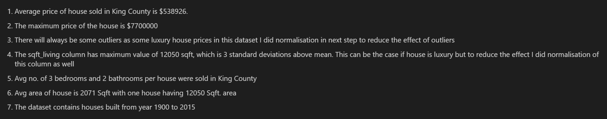
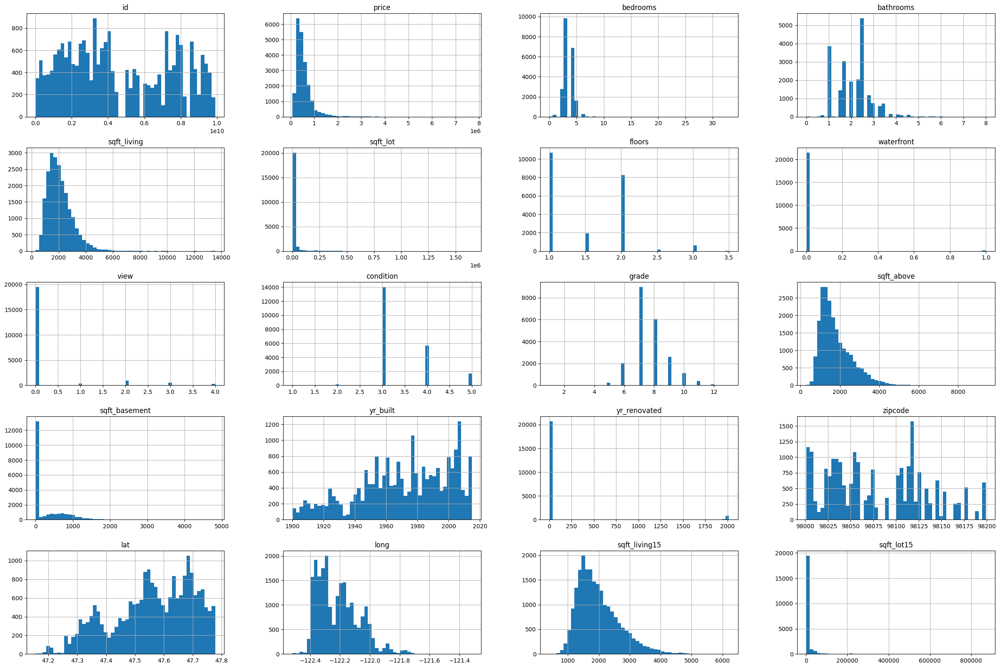
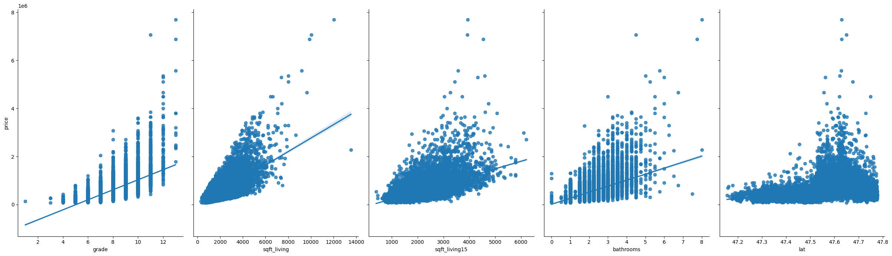

[Python Project](https://www.python.org/downloads/)  

# House-Price-Prediction-Project

This dataset contains house sale prices for King County including homes sold between May 2014 and May 2015. The goal is to predict the sales price for each house based on the given features.  

## Installation  

There are 2 ways to run this project:
  
> Install python and setup the environment.

> Or upload this notebook to 
> 1. Google Colab (https://colab.google/) 
> 2. Jupyter Notebook (https://jupyter.org/try-jupyter/lab/?path=notebooks%2FIntro.ipynb)

  

## Run the Notebook

  

### If you are using Jupyter Notebook or Google Colab:

  

> Once you upload the notebook, ensure you add in the csv file to the same.

> Please note, you will have to edit the file path of csv with your local file path.

> Once both the files are uploaded and the path is edited, you are free to run the notebook online and view the insights gathered by me :star_struck:.

  

### If you are using Python environment

  

> Make sure python is rightly installed in the system using the following command -> python -v

  

> Create a directory and keep both the files in that directory.

  

> Once done, run all the cells of the notebook and check the insights.

## Insights

### Dataset Description

#### Insights of the dataset gathered by me.
> The image below lists the description of insights gathered from the dataset after performing data processing techniques.

#### Histogram plot.

> This image shows depiction of dataset description through histogram with bins=50.

#### With this I am trying to visualize the relation of correlation values.

> The correlation value for grade, sqft_living,sqft_living15, sqft_above ,bathrooms, lat, view, bedrooms, floors are above 0.3 and other features have much less coefficients.

## Issues
  

Incase you have any difficulties or issues while trying to run the app you can raise it on the issues section.
  

## Pull Requests
  

If you have something to add or new idea to implement, you are welcome to create a pull requests on improvement.
  

## Give it a Star
  

If you find this repo useful , give it a star :star: so as many people can get to know it.

  

## Credits

An initiative With :heart: from [Soham Wattamwar ](https://www.linkedin.com/in/soham-wattamwar-9b790119a)